## Настройка vm-app
ОСЬ: Ubuntu Server 22.04
Имя: VM-app
ОЗУ: 2Gb
ПЗУ: 25Gb
Адаптер: NAT

Проброшенные порты:
SSH     TCP         2222        22


### Настройка sshd

1. Cоздал юзера и закинул его в группу *sudo*
    ```
    sudo useradd -m -s /bin/bash user
    sudo usermod -aG sudo user 
    ```

2. Проверил доступность сервиса командой 
    ```
    sudo systemctl status ssh
    ```
3. Загенерил ssh-ключпару
    ``` 
    ssh-keygen -t rsa -b 4096 
    ```
*Данная команда* генерирует ключ пару публичный ключ *pab* и приватный ключ *rsa*. Ключ пара на хосте, выглядит следующим образом: 


Путь до директории с ключами в винде примерно такой *C:\Users\user\.ssh*

4. Закинул pab ключ на виртуалку в папку .ssh в хоум директории
    ``` 
    type C:\Users\user\.ssh\id_rsa.pub | ssh user@localhost -p 2222 "cat >> ~/.ssh/authorized_keys"     
    ```

5. После проверки, залез в /etc/ssh/sshd_config и закинул параметры:
 
    ```
    PasswordAuthentication no
    PermitRootLogin no
    PubkeyAuthentication yes
    ```
6. Ребутнул сервис ssh

    ``` 
    sudo systemctl restart ssh 
    ```
7. Подключение к вертуалке

    ```
    ssh -p 2222 user@127.0.0.1
    ```
Вывод по сервисам:


### Установка Docker Engine
[Доки по установке докера на убунту](https://docs.docker.com/engine/install/ubuntu/)

1. Первым делом залез в доки, посмотрел какими способами можно развернуть докер под убунтой, выбрал способ со скриптом

    ```
    curl -fsSL https://get.docker.com -o get-docker.sh
    sudo sh ./get-docker.sh
    ```
Скрипт:


Запуск скрипта:


2. Проверил состояние докер демона
    ```
    sudo systemctl status docker
    ```
Докер демон: 

3. Закинул юзера в группу докера
    ```
    sudo usermod -aG docker user
    groups user
    ```
Ссш подключение может траить, так что лучше перезайти
Вывод команды groups user: 


4. Запуск и проверка работы docker с помощью тестового hello-world контейнера

    ```
    docker run hello-world
    docker ps -a 
    ```
Первая команда пулит имдж и запускает контейнер, вторая в свою очередь показывает статус по всем контейнерам. Тест прогон и проверка отработки: 


### Развертка проекта
1. Склонировал проект с гитхаба командой 
    ``` 
    git clone 
    ```
2. Инициализировал проект через команду

    ```
    make
    ```
    Она подтянула необходимые зависимости и стартанула контейнеры:
    - mongo
    - reaction
    - reaction-admin
    - examplefront
После инициализации корневой каталог, выглядит слкдующим образом:


3. Залез в композ файлы каждого микросервиса, добавил в них политику рестарта, сохранение данных бд уже было прописано в сервисе mongodb 

    ```Политика рестарта
    restart: unless-stoped
    ```
    Данная политика подимает контейнеры до тех пор, пока не остановим их ручками

    ```Вольюм для хранения данных

        volumes:
            - mongo-db4:/data/db
    ```
    По умолчанию имеет driver: local


4. Залез в Makefile в корневом проекте и заменил все docker-compose на docker compose
    - docker-compose старая версия плагина, которая нужна была для инициализации
    - docker compose в свою очередь актуальная итерация, которая используется в docker engine по умолчанию
Измененные композ файлы лежат в репозитории /src/docker/


5. Прокинул на хост порты сервисов для проверки работы


### Развертка VM-www-db и настройка сервисов внутри
1. Развернул вмку с базовыми настройками, сеть по умолчанию NAT
2. Настроил пользователя admindb (добавил его в группу sudo и docker), настроил ssh закинул публичный колюч, поднял docker engine
3. Собрал Dockerfile для mongodb на базе ubuntu:20.04. Описание докерфайла по строкам:
    - ```FROM ubuntu:22.04``` - сборка контейнера на основе заданного образа
    - ```ENV DEBIAN_FRONTEND=noninteractive``` - отключение вопросов от оси, по типу выбора таймзоны, подтверждения установки и т.д.
    - ```RUN apt-get update && \``` - обновление пакетника
    - ```apt-get install -y gnupg curl ca-certificates && \``` - установка утилит (скачивание файлов, ключики-gpg, церты)
    - ```curl -fsSL https://pgp.mongodb.com/server-4.4.asc | \gpg --dearmor -o /usr/share/keyrings/mongodb.gpg && \``` - добавление gpg-ключей
    - ```echo "deb [ arch=amd64 signed-by=/usr/share/keyrings/mongodb.gpg ] https://repo.mongodb.org/apt/ubuntu focal/mongodb-org/4.4 multiverse" > /etc/apt/sources.list.d/mongodb-org.list && \``` - добавляем репу mongodb
    - ```apt-get update && \``` - повторное обновление пакетника 
    - ```apt-get install -y mongodb-org && \``` - установка mongodb
    - ```apt-get clean && \ rm -rf /var/lib/apt/lists/*``` - очистка, даюы уменьшить итоговый размер
    - ```RUN mkdir -p /data/db``` - создаем папку для бдхи
    - ```VOLUME ["/data/db"]``` - объявляем вольюм что б данные сохранялись после рестарта контейнера
    - ```EXPOSE 27017``` - объявляем порт бдхи
    - ```CMD ["mongod", "--bind_ip_all" , "--replSet", "rs0"]``` - команды запуска
4. Cобираем композ файл и запускаем контейнер, после чего проверяем работу командами:
    ```
        docker compose up -d <- поднимаем композ
        docker ps <- смотрим список поднятых контейнеров
        docker exec -it mongo-vm-ww-db mongo <- заходим в консоль дбхи
        show dbs <- список бдх
    ```
    


    Так же дб можно посмотреть напрямую из командной строки vm, командой:
    ```
    docker exec -it mongo-vm-ww-db mongo --eval "db.adminCommand('listDatabases')"
    ```
    
5. Установка nginx и провкерка работы сервиса
    ```
    sudo apt install nginx
    sudo systemctl status nginx
    ```

6. Далее необходимо настроить конфигурацию nginx сервера, лежать она, /etc/nginx/sites-available/, в этой папке создаем файл proxy.conf: 
    ```
    server {
        listen 80;
        server_name _;

        # User front
        location / {
            proxy_pass http://10.0.2.2:4000;
            proxy_set_header Host $host;
            proxy_set_header X-Real-IP $remote_addr;
            proxy_set_header X-Forwarded-For $proxy_add_x_forwarded_for;
        }
    }

    server {
        listen 8080;
        server_name _;

        location / {
            proxy_pass http://10.0.2.2:4080;
            proxy_set_header Host $host;
            proxy_set_header X-Real-IP $remote_addr;
            proxy_set_header X-Forwarded-For $proxy_add_x_forwarded_for;
            proxy_set_header Accept-Encoding "";

            proxy_buffer_size 256k;
            proxy_buffers 8 512k;
            proxy_busy_buffers_size 512k;
            proxy_temp_file_write_size 512k;
        }
    }
    ```
В данном случе, нгинкс работает как реверс прокси и через хост 10.0.2.2, обращается к портам VM-app. После конфигурации, необходимо создать симилинк :
    ```
    sudo ln -s /etc/nginx/sites-available/proxy.conf /etc/nginx/sites-enabled/
    ```

Далее проверяем конфигурцию командой
    ```
    sudo nginx -t
    ```
    
Далее рестартим nginx через ```sudo systemctl restart nginx```, что бы сервер подхватил изменения

7. Далее необходимо открыть http порты в ufw
    ```
    ufw allow http
    ufw allow 8080/tcp
    ```
Эта команда откроет 80 и 8080 поры:
    

8. Проверяем что все работает на 
    ```
    localhost
    localhost:8080
    ```
    Резульатом, браузер открывает все по портам 80 и 8080, соответсвенно nginx все проксирует корректно
    
    

Так же по заданию докидываем в продукт доп картинку
    
    

### Перенос баз данных mongodb с vm-app на vm-www-db

1. Командой ```docker ps``` узнаем имя контейнера который крутит mongodb.
   И переходим к дампу базы данных, делается следующим образом:
    ```
    docker exec e7bdfd820817_reaction-mongo-1 mongodump --out /dump
    ```
    Данная команда сделает дамп внтури контейнера, что бы вытащить эту папку, необходимо скопировать ее на вмку
    ```
    docker cp e7bdfd820817_reaction-mongo-1:/dump ./mongodb_dump
    ```
    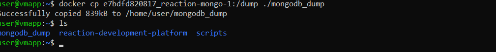

    После чего сносим внутри контейнера папку с дампом:
    ```docker exec e7bdfd820817_reaction-mongo-1 rm -rf /dump```

2. Как только мы сделали дамп данных, надо scpшнуть на хост папку с эими самыми данными:
    ```
    scp -P 2222 -r user@localhost:~/mongodb_dump ./mongodb_dump
    ```
   Далее перекидываем с хоста папку на vm-www-db:
    ```
    scp -P 2223 -r ./mongodb_dump admindb@127.0.0.1:~/
    ```
    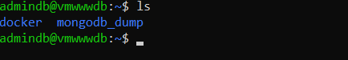

3. Переходим к восстановлению бдхи на VM-www-db, поскольку у нас уже был запущен контейнер c mongodb, мы копируем в него дамп
    ```
    docker cp ~/mongodb_dump mongo-vm-ww-db:/dump
    ```
    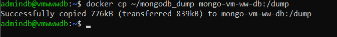

    Далее делаем востановление через mongorestore внутри докер контейнера:

    ```
    docker exec mongo-vm-ww-db mongorestore --drop /dump
    ```
    Флаг --drop, дает гарантию что при востановление бдхи будут идентичны, посколько сносит существующие колекции перед востановлением
    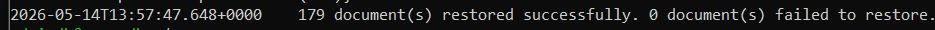

4. Следующим шагом, перекинем сервисы на бдху развернутую на vm-www-db
    Первым делом, прокидываем в virtualbox следующий порт
    ```
    протокол    адрес хоста     порт хоста  порт гостя
    tcp         127.0.0.1       27019       27017
    ```
    Поскольку бдха используется сразу в нескольких сервисах, а именно reaction-admin и reaction, необходимо перенастроить их .env конфиги и перезапустить docker контейнеры

    Первым делом, переходим по пути *~/reaction-development-platform/reaction* и заходим там в *.env*. Находим строку MONGO_URL=mongodb://mongo.reaction.localhost:27017/reaction и заменяем ее на MONGO_URL=mongodb://10.0.2.2:27019/reaction, после чего пересобираем контейнер

    Далее переходим по пути *~/reaction-development-platform/reaction-admin* и заходим в *.env*. Находим мледующие строки:
        - MONGO_OPLOG_URL=mongodb://mongo.reaction.localhost:27017/local
        - MONGO_URL=mongodb://mongo.reaction.localhost:27017/reaction
    Результат выполнения
    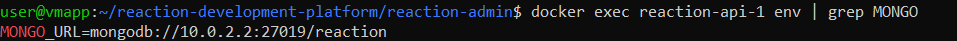

    И меняем на
        - MONGO_OPLOG_URL=mongodb://10.0.2.2:27019/local
        - MONGO_URL=mongodb://10.0.2.2:27019/reaction
    Результат выполнения
    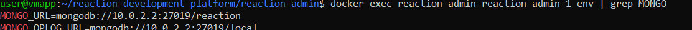

    После всего, идем в браузер и смотрим, как ведет себя приложение, в моем случае изменений не было

Резюмируя, сервисы общаются с БД следующим образом: приложения reaction и reaction-admin, запущенные на VM-app, подключаются к MongoDB по адресу 10.0.2.2:27019. Этот адрес является шлюзом NAT и ведёт на хост-машину. На хосте настроен проброс порта 127.0.0.1:27019 → VM-www-db:27017, поэтому весь трафик автоматически перенаправляется на целевой контейнер с MongoDB, работающий на VM-www-db.

### Настрока ssl
1. Создаем папку под ssl и настраиваем ей права
    ```
    sudo mkdir -p /etc/ssl/private
    sudo chmod 755 /etc/ssl/private
    ```
2. Генерируем ключ-пару через openssl:

    ```
    sudo openssl req -x509 -nodes -days 365 -newkey rsa:2048 \
        -keyout /etc/ssl/private/nginx-selfsigned.key \
        -out /etc/ssl/certs/nginx-selfsigned.crt \
        -subj "/CN=localhost"
    ```
    Пояснение параметров:
        -x509 — создает самоподписанный сертификат;
        -nodes — создает ключ без парольной фразы;
        -days 365 — срок действия 1 год;
        -subj "/CN=localhost" — задает Common Name (ваш IP или домен).
        -Сертификат: /etc/ssl/certs/nginx-selfsigned.crt
        -Приватный ключ: /etc/ssl/private/nginx-selfsigned.key

3. Меняем конфиг nginx для работы с ssl и редиректом, переходим в */etc/nginx/sites-available/proxy.conf* и меняем конфигурацию следующим образом:
    ```
    server {
        listen 80;
        server_name _;
        return 301 https://$host$request_uri;
    }

    server {
        listen 443 ssl http2;
        server_name _;

        # SSL сертификаты
        ssl_certificate /etc/ssl/certs/nginx-selfsigned.crt;
        ssl_certificate_key /etc/ssl/private/nginx-selfsigned.key;

        # Настройки SSL
        ssl_protocols TLSv1.2 TLSv1.3;
        ssl_ciphers HIGH:!aNULL:!MD5;

        # User front
        location / {
            proxy_pass http://10.0.2.2:4000;
            proxy_set_header Host $host;
            proxy_set_header X-Real-IP $remote_addr;
            proxy_set_header X-Forwarded-For $proxy_add_x_forwarded_for;
            proxy_set_header X-Forwarded-Proto $scheme;
        }
    }

    server {
        listen 8443 ssl http2;
        server_name _;

        # SSL сертификаты
        ssl_certificate /etc/ssl/certs/nginx-selfsigned.crt;
        ssl_certificate_key /etc/ssl/private/nginx-selfsigned.key;

        # Настройки SSL
        ssl_protocols TLSv1.2 TLSv1.3;
        ssl_ciphers HIGH:!aNULL:!MD5;

        location / {
            proxy_pass http://10.0.2.2:4080;
            proxy_set_header Host $host;
            proxy_set_header X-Real-IP $remote_addr;
            proxy_set_header X-Forwarded-For $proxy_add_x_forwarded_for;
            proxy_set_header X-Forwarded-Proto $scheme;
            proxy_set_header Accept-Encoding "";

            proxy_buffer_size 256k;
            proxy_buffers 8 512k;
            proxy_busy_buffers_size 512k;
            proxy_temp_file_write_size 512k;
        }
    }
    ```
    Проверям синтаксис и перезапускаем nignx
    ```
        nxinx -t
        sudo systemctl restart nginx
    ```

    Пробрасываем порты в фаерволе
    ```
    sudo ufw allow 443/tcp
    sudo ufw allow 8443/tcp
    ```

    Смотрим все ли работает в браузере:
    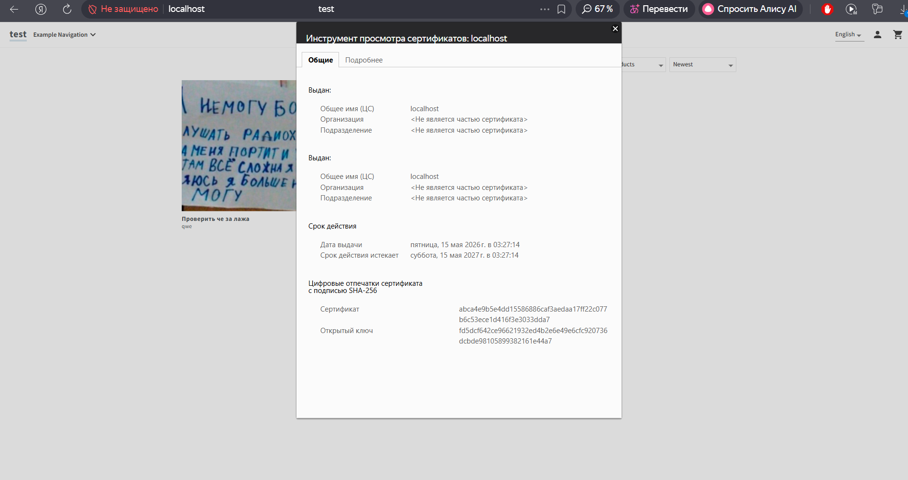


### Настрока сбора логов с контейнеров
1. Для сборки и анализа логов будет использоваться rsyslog. Первым делом создаем папки для хранения логов:
    ```
    sudo mkdir -p /var/log/central/{vm-app,vm-www-db}
    sudo mkdir -p /var/log/central/services/{reaction-api,reaction-admin,storefront,mongodb}
    ```
2. Далее создаем файл конфигурации для VM-app

    ```
    sudo nano /etc/rsyslog.d/99-central.conf
    ```

    Файл конфигурации:
    ```
    module(load="imudp")
    module(load="imtcp")

    input(type="imudp" port="514" address="0.0.0.0")
    input(type="imtcp" port="514" address="0.0.0.0")

    $template StructuredFormat,"%HOSTNAME% | %syslogtag% | %syslogseverity-text% | %msg%\\n"

    # Шаблоны
    $template ReactionAPILog,"/var/log/central/services/reaction-api/reaction-api.log"
    $template ReactionAdminLog,"/var/log/central/services/reaction-admin/reaction-admin.log"
    $template StorefrontLog,"/var/log/central/services/storefront/storefront.log"
    $template MongoLog,"/var/log/central/services/mongodb/mongodb.log"
    $template VMAppLog,"/var/log/central/vm-app/system.log"
    $template VMWwwDbLog,"/var/log/central/vm-www-db/system.log"

    # VM-www-db
    if $hostname == 'vmwwwdb' then {
        # MongoDB контейнер
        if $msg contains 'mongodb' or $msg contains 'MongoDB' or $programname contains 'mongo' then {
            action(type="omfile" file="/var/log/central/services/mongodb/mongodb.log" template="StructuredFormat")
        } else {
            # Остальные логи VM-www-db
            action(type="omfile" file="/var/log/central/vm-www-db/system.log" template="StructuredFormat")
        }
        stop
    }

    # VM-app
    if $hostname == 'vmapp' then {
        # Reaction API
        if $msg contains 'reaction-api' or $programname contains 'reaction-api' then {
            action(type="omfile" file="/var/log/central/services/reaction-api/reaction-api.log" template="StructuredFormat")
        }
        # Reaction Admin
        else if $msg contains 'reaction-admin' or $programname contains 'reaction-admin' then {
            action(type="omfile" file="/var/log/central/services/reaction-admin/reaction-admin.log" template="StructuredFormat")
        }
        # Storefront
        else if $msg contains 'storefront' or $programname contains 'storefront' then {
            action(type="omfile" file="/var/log/central/services/storefront/storefront.log" template="StructuredFormat")
        }
        # MongoDB на VM-app
        else if $msg contains 'mongodb' or $programname contains 'mongo' then {
            action(type="omfile" file="/var/log/central/services/mongodb/mongodb-app.log" template="StructuredFormat")
        }
        else {
            # Остальные логи VM-app
            action(type="omfile" file="/var/log/central/vm-app/system.log" template="StructuredFormat")
        }
        stop
    }

    *.* action(type="omfile" file="/var/log/central/other.log" template="StructuredFormat")
    ```
3. Создадим файл конфигурации для vm-www-db,  */etc/rsyslog.d/99-forward.conf*, конфиг выглядит следующим образом:

    ```
    *.* @@10.0.2.2:514
    $PreserveFQDN on
    ```

    Этот темплейт отправляет логи на vm-app с сохраненем hostname

4. Далее на обоих машинах необходимо настроить */etc/docker/daemon.json*, добавив в него следующее:
    ```
    {
        "log-driver": "syslog",
        "log-opts": {
            "syslog-address": "udp://localhost:514",
            "tag": "{{.Name}}",
            "labels": "com.docker.compose.service",
            "syslog-facility": "daemon",
            "syslog-format": "rfc5424"
        }
    }
    ```
    Далее ребутаем докер на обоих вмках и перезапускаем контейнеры, после чего проверяем подхватили ли они новый драйвер

    ```
    docker inspect --format='{{.Name}}: {{.HostConfig.LogConfig.Type}}' $(docker ps -aq)
    ```

    Вывод команды:
    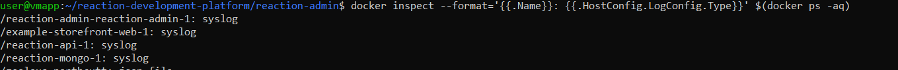`

5. Проверяем логи через vm-app командой 
    ```
    sudo tail -f /var/log/syslog | grep -E "reaction-api|reaction-admin|storefront|mongo"
    ```

    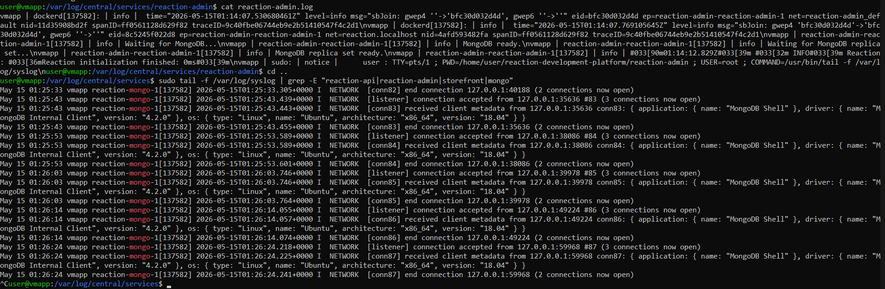

### Утилиты для анализа системных ресурсов

Для анализа CPU/RAM htop 
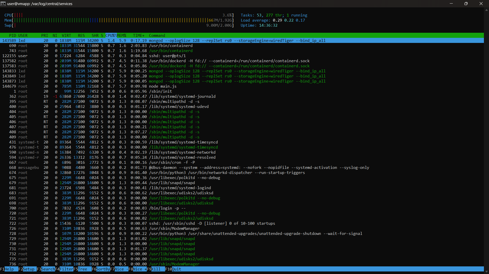

Для анализа всего остального nmon

Диски:
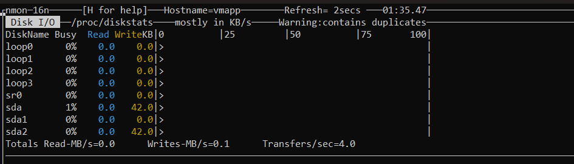

Сеть:
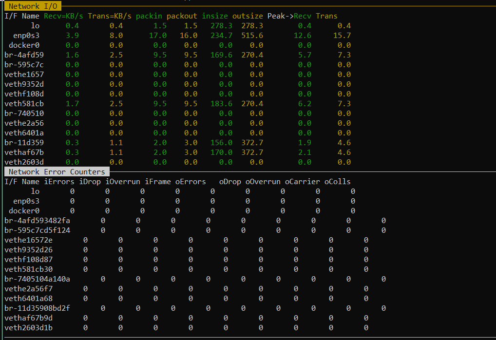

### Создаем 3 вм и настраиваем реплика сет

1.  Развернул VM-mongodb, настроил ssh, настроил docker, пробросил порты на вмке и фаерволе

2. Поднял на основе Dockerfile и docker-compose файла еще один инстанс mongodb
    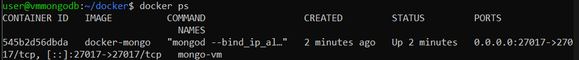

3. Пробросил порты на VMки, таким образом что б при подключении все не всхлопнулось:
    ```
    vm-app      tcp     27017  -> 27017
    vm-www-db   tcp     27019  -> 27017
    vm-mongoap  tcp     27020  -> 27017
    ```
Данный проброс позволяет работать с репликасетом по NAT и не пробрасывать host-only сеть в virtual box

    *Траблшутинг*
    При первой инициализации была проблема с тем что mongodb поднимался с полным хаосом в параметре host, решением данной проблемы является удаление параметра *--replSet rs0* из Dockerfile в docker-compose конфигурацию, после чего на контейнера который поднялся первым уже проводим объеденение инстансов в репликасет


3. Объеденяем инстансы в реплика сет
    В качестве мастер ноды была выбрана VM-app. Открываем шелл и инициализируем реплика сет:
    ```
    docker exec -it reaction-mongo-1 mongo
    rs.initiate()
    ```
    В моем случае, инициализация делается через докер файл, так что инициализация и так была
    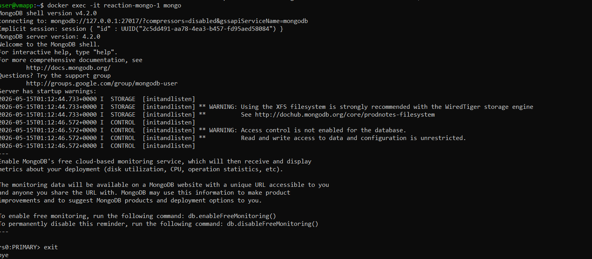

    Докидываем в replica set остальные вмки:
    ```
    rs.add("10.0.2.2:27019")
    rs.add("10.0.2.2:27020")

    ```
    
    Командой rs.status() проверяем как прошло добавление инстансов. Вывод команды при успешном выполнении следующий:
    ```
    rs0:SECONDARY> rs.status()
        {
                "set" : "rs0",
                "date" : ISODate("2026-05-17T09:29:52.652Z"),
                "myState" : 2,
                "term" : NumberLong(1),
                "syncSourceHost" : "10.0.2.2:27017",
                "syncSourceId" : 1,
                "heartbeatIntervalMillis" : NumberLong(2000),
                "majorityVoteCount" : 2,
                "writeMajorityCount" : 2,
                "votingMembersCount" : 3,
                "writableVotingMembersCount" : 3,
                "optimes" : {
                        "lastCommittedOpTime" : {
                                "ts" : Timestamp(1779010185, 1),
                                "t" : NumberLong(1)
                        },
                        "lastCommittedWallTime" : ISODate("2026-05-17T09:29:45.176Z"),
                        "readConcernMajorityOpTime" : {
                                "ts" : Timestamp(1779010185, 1),
                                "t" : NumberLong(1)
                        },
                        "readConcernMajorityWallTime" : ISODate("2026-05-17T09:29:45.176Z"),
                        "appliedOpTime" : {
                                "ts" : Timestamp(1779010185, 1),
                                "t" : NumberLong(1)
                        },
                        "durableOpTime" : {
                                "ts" : Timestamp(1779010185, 1),
                                "t" : NumberLong(1)
                        },
                        "lastAppliedWallTime" : ISODate("2026-05-17T09:29:45.176Z"),
                        "lastDurableWallTime" : ISODate("2026-05-17T09:29:45.176Z")
                },
                "lastStableRecoveryTimestamp" : Timestamp(1779010185, 1),
                "members" : [
                        {
                                "_id" : 0,
                                "name" : "10.0.2.2:27019",
                                "health" : 1,
                                "state" : 1,
                                "stateStr" : "PRIMARY",
                                "uptime" : 968,
                                "optime" : {
                                        "ts" : Timestamp(1779010185, 1),
                                        "t" : NumberLong(1)
                                },
                                "optimeDurable" : {
                                        "ts" : Timestamp(1779010185, 1),
                                        "t" : NumberLong(1)
                                },
                                "optimeDate" : ISODate("2026-05-17T09:29:45Z"),
                                "optimeDurableDate" : ISODate("2026-05-17T09:29:45Z"),
                                "lastAppliedWallTime" : ISODate("2026-05-17T09:29:45.176Z"),
                                "lastDurableWallTime" : ISODate("2026-05-17T09:29:45.176Z"),
                                "lastHeartbeat" : ISODate("2026-05-17T09:29:52.567Z"),
                                "lastHeartbeatRecv" : ISODate("2026-05-17T09:29:50.756Z"),
                                "pingMs" : NumberLong(2),
                                "lastHeartbeatMessage" : "",
                                "syncSourceHost" : "",
                                "syncSourceId" : -1,
                                "infoMessage" : "",
                                "electionTime" : Timestamp(1779008894, 2),
                                "electionDate" : ISODate("2026-05-17T09:08:14Z"),
                                "configVersion" : 3,
                                "configTerm" : 1
                        },
                        {
                                "_id" : 1,
                                "name" : "10.0.2.2:27017",
                                "health" : 1,
                                "state" : 2,
                                "stateStr" : "SECONDARY",
                                "uptime" : 968,
                                "optime" : {
                                        "ts" : Timestamp(1779010185, 1),
                                        "t" : NumberLong(1)
                                },
                                "optimeDurable" : {
                                        "ts" : Timestamp(1779010185, 1),
                                        "t" : NumberLong(1)
                                },
                                "optimeDate" : ISODate("2026-05-17T09:29:45Z"),
                                "optimeDurableDate" : ISODate("2026-05-17T09:29:45Z"),
                                "lastAppliedWallTime" : ISODate("2026-05-17T09:29:45.176Z"),
                                "lastDurableWallTime" : ISODate("2026-05-17T09:29:45.176Z"),
                                "lastHeartbeat" : ISODate("2026-05-17T09:29:52.604Z"),
                                "lastHeartbeatRecv" : ISODate("2026-05-17T09:29:52.063Z"),
                                "pingMs" : NumberLong(2),
                                "lastHeartbeatMessage" : "",
                                "syncSourceHost" : "10.0.2.2:27019",
                                "syncSourceId" : 0,
                                "infoMessage" : "",
                                "configVersion" : 3,
                                "configTerm" : 1
                        },
                        {
                                "_id" : 2,
                                "name" : "10.0.2.2:27020",
                                "health" : 1,
                                "state" : 2,
                                "stateStr" : "SECONDARY",
                                "uptime" : 1226,
                                "optime" : {
                                        "ts" : Timestamp(1779010185, 1),
                                        "t" : NumberLong(1)
                                },
                                "optimeDate" : ISODate("2026-05-17T09:29:45Z"),
                                "lastAppliedWallTime" : ISODate("2026-05-17T09:29:45.176Z"),
                                "lastDurableWallTime" : ISODate("2026-05-17T09:29:45.176Z"),
                                "syncSourceHost" : "10.0.2.2:27017",
                                "syncSourceId" : 1,
                                "infoMessage" : "",
                                "configVersion" : 3,
                                "configTerm" : 1,
                                "self" : true,
                                "lastHeartbeatMessage" : ""
                        }
                ],
                "ok" : 1,
                "$clusterTime" : {
                        "clusterTime" : Timestamp(1779010185, 1),
                        "signature" : {
                                "hash" : BinData(0,"AAAAAAAAAAAAAAAAAAAAAAAAAAA="),
                                "keyId" : NumberLong(0)
                        }
                },
                "operationTime" : Timestamp(1779010185, 1)
        }
    ```
    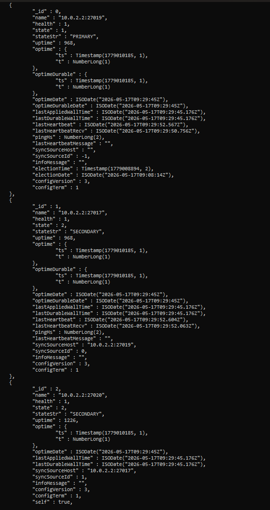

    После чего в *.env* файлах пробрасываем репликасет. В нашем случае:
    Для бэка:
    ```
    MONGO_URL=mongodb://10.0.2.2:27017,10.0.2.2:27019,10.0.2.2:27020/reaction?replicaSet=rs0
    ```
    Для админки:
    ```
    MONGO_URL=mongodb://10.0.2.2:27017,10.0.2.2:27019,10.0.2.2:27020/reaction?replicaSet=rs0
    MONGO_OPLOG_URL=mongodb://10.0.2.2:27017,10.0.2.2:27019,10.0.2.2:27020/local?replicaSet=rs0
    ```
    Далее смотрим какая нода выступает в replicaset PRIMARY и роняем ее для проверки того, что реплика сет переключил управление на другую ноду, после чего проверяем приложение на работоспособность
    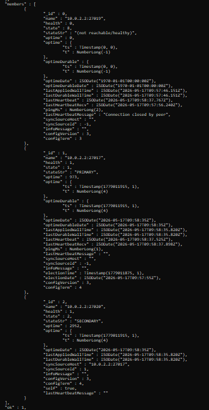

### Ограничение доступов по сети

Для ограничения доступов из вне, будем юзать базовый фаервол ufw. Политика +- следующая:

    - 22 порт доступен с любого ипишника
    - бдшки только из под 10.0.2.2 на каждой вм
    - http/https на vm-www-db - доступны с любого ипишника
    - все остальное либо режектиться, либо доступно долько из под 10.0.2.2

Итоговоый фаервол на вмках выглядит следующим образом:

VM-app:
```
user@vmapp:~$ sudo ufw status verbose
Status: active
Logging: on (low)
Default: deny (incoming), allow (outgoing), deny (routed)
New profiles: skip

To                         Action      From
--                         ------      ----
22/tcp                     ALLOW IN    Anywhere
3000/tcp                   ALLOW IN    10.0.2.2
4000/tcp                   ALLOW IN    10.0.2.2
4080/tcp                   ALLOW IN    10.0.2.2
27017/tcp                  ALLOW IN    10.0.2.2
514/tcp                    ALLOW IN    10.0.2.2
514/udp                    ALLOW IN    10.0.2.2
```

VM-www-db:
```
admindb@vmwwwdb:~$ sudo ufw status verbose
Status: active
Logging: on (low)
Default: deny (incoming), allow (outgoing), deny (routed)
New profiles: skip

To                         Action      From
--                         ------      ----
22/tcp                     ALLOW IN    Anywhere
80/tcp                     ALLOW IN    Anywhere
8080/tcp                   ALLOW IN    Anywhere
443/tcp                    ALLOW IN    Anywhere
8443/tcp                   ALLOW IN    Anywhere
27017/tcp                  ALLOW IN    10.0.2.2
```

VM-mongodb:
```
user@vmmongodb:~/docker$ sudo ufw status verbose
Status: active
Logging: on (low)
Default: deny (incoming), allow (outgoing), deny (routed)
New profiles: skip

To                         Action      From
--                         ------      ----
22/tcp                     ALLOW IN    Anywhere
27017/tcp                  ALLOW IN    10.0.2.2

```