## Настройка vm-app
ОСЬ: Ubuntu Server 22.04
Имя: VM-app
ОЗУ: 2Gb
ПЗУ: 25Gb
Адаптер: NAT

Проброшенные порты:
SSH     TCP         2222        22


### Настройка sshd

1. Cоздал юзера и закинул его в группу *sudo*
    ```
    sudo useradd -m -s /bin/bash user
    sudo usermod -aG sudo user 
    ```

2. Проверил доступность сервиса командой 
    ```
    sudo systemctl status ssh
    ```
3. Загенерил ssh-ключпару
    ``` 
    ssh-keygen -t rsa -b 4096 
    ```
*Данная команда* генерирует ключ пару публичный ключ *pab* и приватный ключ *rsa*. Ключ пара на хосте, выглядит следующим образом: 


Путь до директории с ключами в винде примерно такой *C:\Users\user\.ssh*

4. Закинул pab ключ на виртуалку в папку .ssh в хоум директории
    ``` 
    type C:\Users\user\.ssh\id_rsa.pub | ssh user@localhost -p 2222 "cat >> ~/.ssh/authorized_keys"     
    ```

5. После проверки, залез в /etc/ssh/sshd_config и закинул параметры:
 
    ```
    PasswordAuthentication no
    PermitRootLogin no
    PubkeyAuthentication yes
    ```
6. Ребутнул сервис ssh

    ``` 
    sudo systemctl restart ssh 
    ```
7. Подключение к вертуалке

    ```
    ssh -p 2222 user@127.0.0.1
    ```
Вывод по сервисам:


### Установка Docker Engine
[Доки по установке докера на убунту](https://docs.docker.com/engine/install/ubuntu/)

1. Первым делом залез в доки, посмотрел какими способами можно развернуть докер под убунтой, выбрал способ со скриптом

    ```
    curl -fsSL https://get.docker.com -o get-docker.sh
    sudo sh ./get-docker.sh
    ```
Скрипт:


Запуск скрипта:


2. Проверил состояние докер демона
    ```
    sudo systemctl status docker
    ```
Докер демон: 

3. Закинул юзера в группу докера
    ```
    sudo usermod -aG docker user
    groups user
    ```
Ссш подключение может траить, так что лучше перезайти
Вывод команды groups user: 


4. Запуск и проверка работы docker с помощью тестового hello-world контейнера

    ```
    docker run hello-world
    docker ps -a 
    ```
Первая команда пулит имдж и запускает контейнер, вторая в свою очередь показывает статус по всем контейнерам. Тест прогон и проверка отработки: 


### Развертка проекта
1. Склонировал проект с гитхаба командой 
    ``` 
    git clone 
    ```
2. Инициализировал проект через команду

    ```
    make
    ```
    Она подтянула необходимые зависимости и стартанула контейнеры:
    - mongo
    - reaction
    - reaction-admin
    - examplefront
После инициализации корневой каталог, выглядит слкдующим образом:
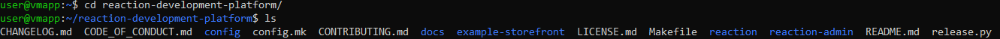

3. Залез в композ файлы каждого микросервиса, добавил в них политику рестарта, сохранение данных бд уже было прописано в сервисе mongodb 

    ```Политика рестарта
    restart: unless-stoped
    ```
    Данная политика подимает контейнеры до тех пор, пока не остановим их ручками

    ```Вольюм для хранения данных

        volumes:
            - mongo-db4:/data/db
    ```
    По умолчанию имеет driver: local


4. Залез в Makefile в корневом проекте и заменил все docker-compose на docker compose
    - docker-compose старая версия плагина, которая нужна была для инициализации
    - docker compose в свою очередь актуальная итерация, которая используется в docker engine по умолчанию
Измененные композ файлы лежат в репозитории /src/docker/
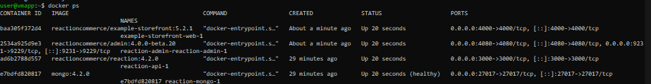

5. Прокинул на хост порты сервисов для проверки работы
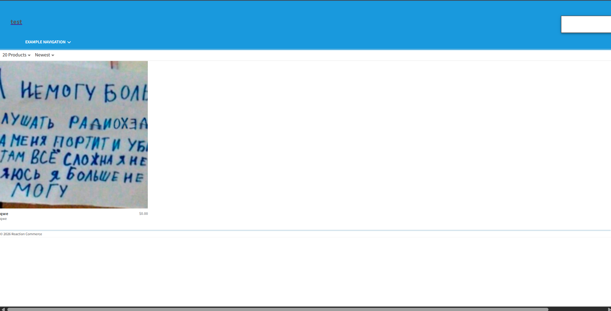
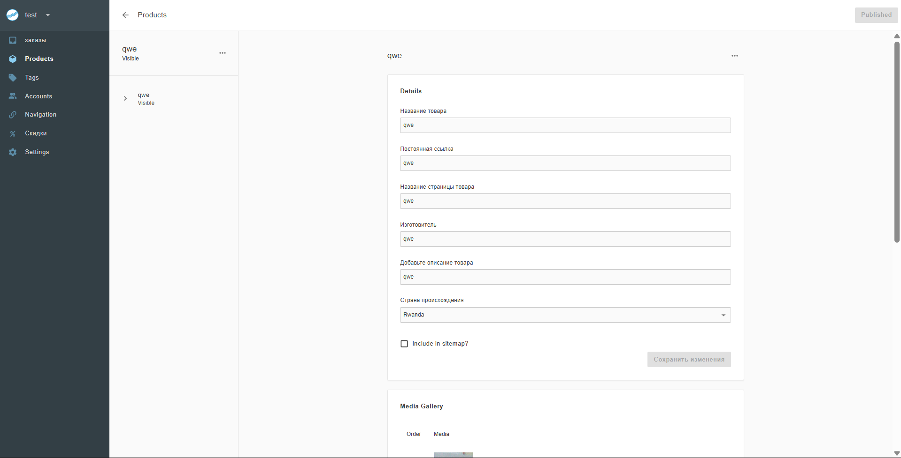

### Развертка VM-www-db и настройка сервисов внутри
1. Развернул вмку с базовыми настройками, сеть по умолчанию NAT
2. Настроил пользователя admindb (добавил его в группу sudo и docker), настроил ssh закинул публичный колюч, поднял docker engine
3. Собрал Dockerfile для mongodb на базе ubuntu:20.04. Описание докерфайла по строкам:
    - ```FROM ubuntu:22.04``` - сборка контейнера на основе заданного образа
    - ```ENV DEBIAN_FRONTEND=noninteractive``` - отключение вопросов от оси, по типу выбора таймзоны, подтверждения установки и т.д.
    - ```RUN apt-get update && \``` - обновление пакетника
    - ```apt-get install -y gnupg curl ca-certificates && \``` - установка утилит (скачивание файлов, ключики-gpg, церты)
    - ```curl -fsSL https://pgp.mongodb.com/server-4.4.asc | \gpg --dearmor -o /usr/share/keyrings/mongodb.gpg && \``` - добавление gpg-ключей
    - ```echo "deb [ arch=amd64 signed-by=/usr/share/keyrings/mongodb.gpg ] https://repo.mongodb.org/apt/ubuntu focal/mongodb-org/4.4 multiverse" > /etc/apt/sources.list.d/mongodb-org.list && \``` - добавляем репу mongodb
    - ```apt-get update && \``` - повторное обновление пакетника 
    - ```apt-get install -y mongodb-org && \``` - установка mongodb
    - ```apt-get clean && \ rm -rf /var/lib/apt/lists/*``` - очистка, даюы уменьшить итоговый размер
    - ```RUN mkdir -p /data/db``` - создаем папку для бдхи
    - ```VOLUME ["/data/db"]``` - объявляем вольюм что б данные сохранялись после рестарта контейнера
    - ```EXPOSE 27017``` - объявляем порт бдхи
    - ```CMD ["mongod", "--bind_ip_all"]``` - старт, *--bind_ip_all* дает возможность подрубаться с других контейнеров
4. Cобираем композ файл и запускаем контейнер, после чего проверяем работу командами:
    ```
        docker compose up -d <- поднимаем композ
        docker ps <- смотрим список поднятых контейнеров
        docker exec -it mongo-vm-ww-db mongo <- заходим в консоль дбхи
        show dbs <- список бдх
    ```
    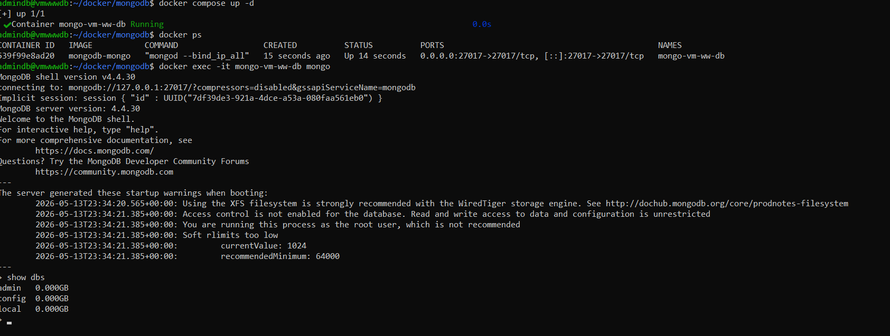


    Так же дб можно посмотреть напрямую из командной строки vm, командой:
    ```
    docker exec -it mongo-vm-ww-db mongo --eval "db.adminCommand('listDatabases')"
    ```
    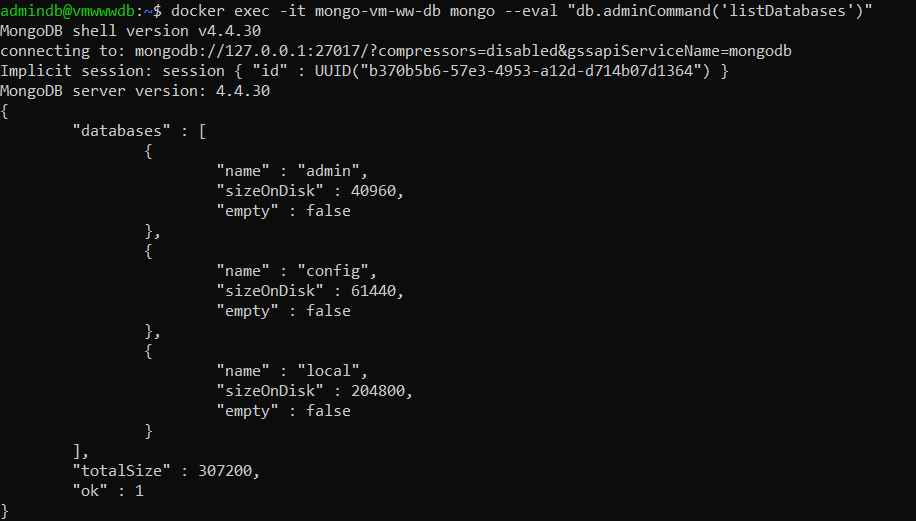
5. Установка nginx и провкерка работы сервиса
    ```
    sudo apt install nginx
    sudo systemctl status nginx
    ```
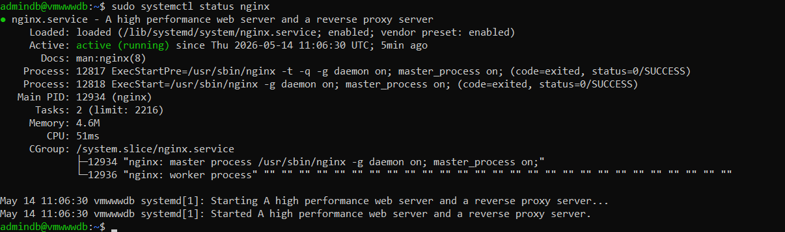
6. Далее необходимо настроить конфигурацию nginx сервера, лежать она, /etc/nginx/sites-available/, в этой папке создаем файл proxy.conf: 
    ```
    server {
        listen 80;
        server_name _;

        # User front
        location / {
            proxy_pass http://10.0.2.2:4000;
            proxy_set_header Host $host;
            proxy_set_header X-Real-IP $remote_addr;
            proxy_set_header X-Forwarded-For $proxy_add_x_forwarded_for;
        }
    }

    server {
        listen 8080;
        server_name _;

        location / {
            proxy_pass http://10.0.2.2:4080;
            proxy_set_header Host $host;
            proxy_set_header X-Real-IP $remote_addr;
            proxy_set_header X-Forwarded-For $proxy_add_x_forwarded_for;
            proxy_set_header Accept-Encoding "";

            proxy_buffer_size 256k;
            proxy_buffers 8 512k;
            proxy_busy_buffers_size 512k;
            proxy_temp_file_write_size 512k;
        }
    }
    ```
В данном случе, нгинкс работает как реверс прокси и через хост 10.0.2.2, обращается к портам VM-app. После конфигурации, необходимо создать симилинк :
    ```
    sudo ln -s /etc/nginx/sites-available/proxy.conf /etc/nginx/sites-enabled/
    ```

Далее проверяем конфигурцию командой
    ```
    sudo nginx -t
    ```
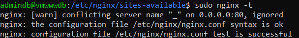
Далее рестартим nginx через ```sudo systemctl restart nginx```, что бы сервер подхватил изменения

7. Далее необходимо открыть http порты в ufw
    ```
    ufw allow http
    ufw allow 8080/tcp
    ```
Эта команда откроет 80 и 8080 поры:
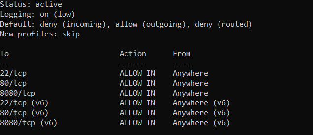
8. Проверяем что все работает на 
    ```
    localhost
    localhost:8080
    ```
Резульатом, браузер открывает все по портам 80 и 8080, соответсвенно nginx все проксирует корректно
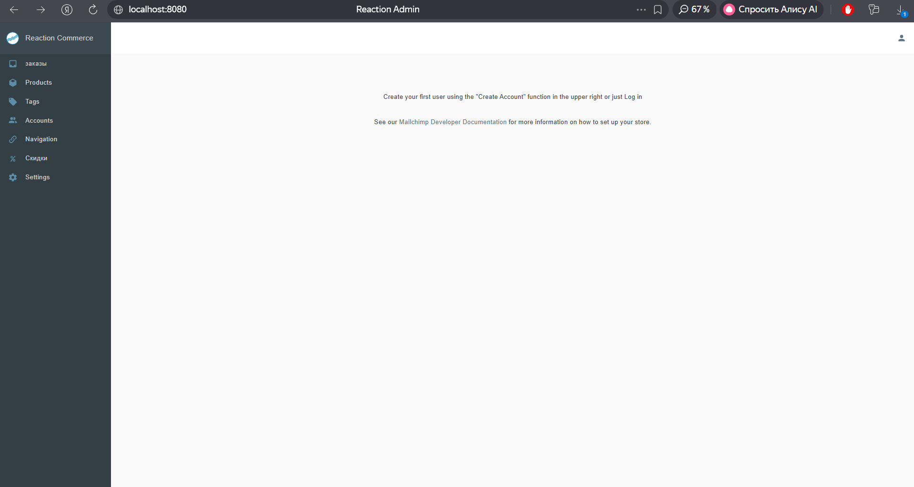
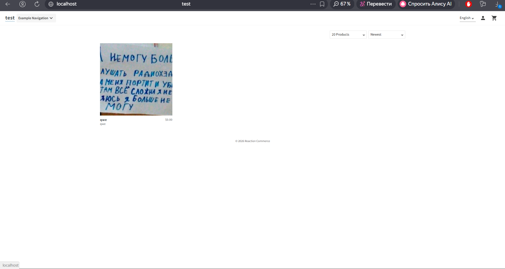

Так же по заданию докидываем в продукт доп картинку
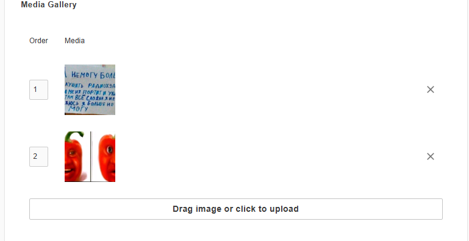
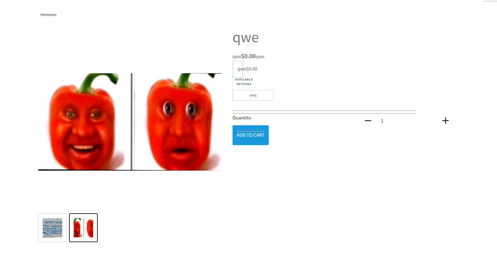

>ssh -p 2223 admindb@127.0.0.1 
>ssh -p 2222 user@127.0.0.1 