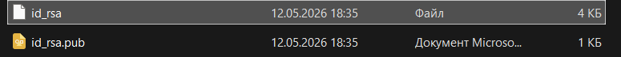
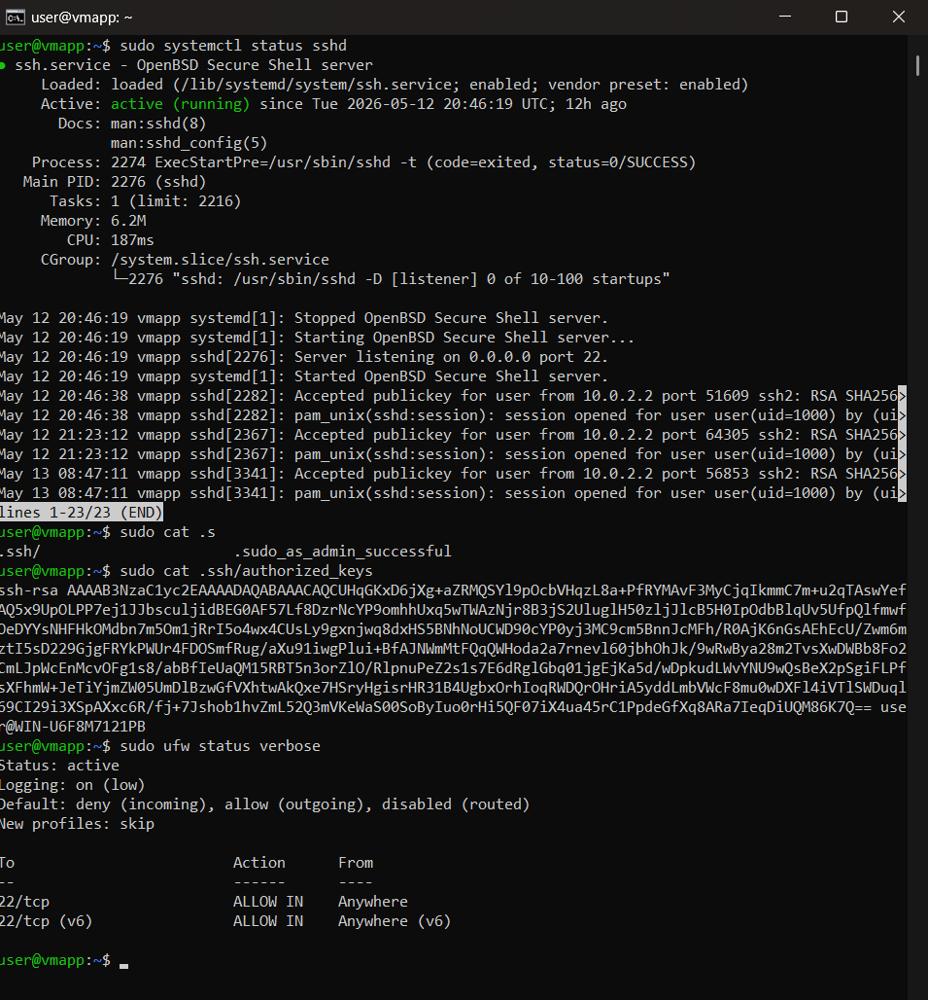
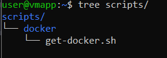
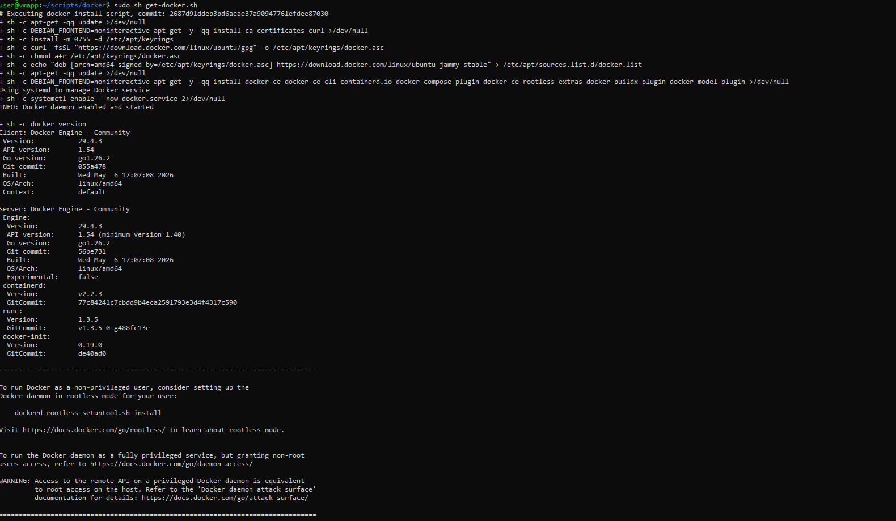
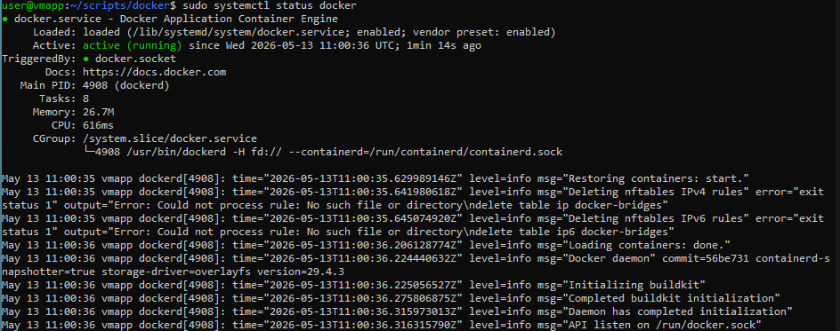
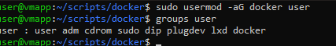
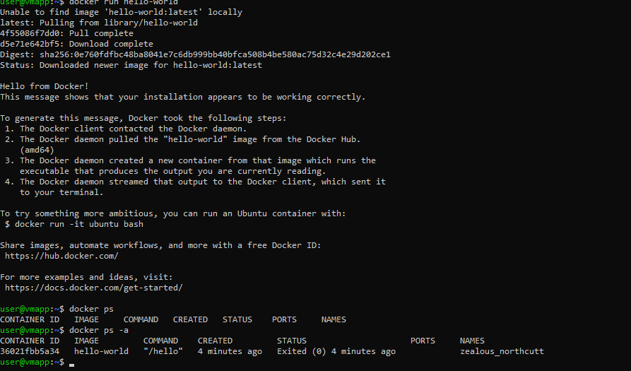

## Настройка vm-app
ОСЬ: Ubuntu Server 22.04
Имя: VM-app
ОЗУ: 2Gb
ПЗУ: 25Gb
Адаптер: NAT

Проброшенные порты:
SSH     TCP         2222        22


### Настройка sshd

1. Cоздал юзера и закинул его в группу *sudo*
    ```
    sudo useradd -m -s /bin/bash user
    sudo usermod -aG sudo user 
    ```

2. Проверил доступность сервиса командой 
    ```
    sudo systemctl status ssh
    ```
3. Загенерил ssh-ключпару
    ``` 
    ssh-keygen -t rsa -b 4096 
    ```
*Данная команда* генерирует ключ пару публичный ключ *pab* и приватный ключ *rsa*
Ключ пара на хосте, выглядит следующим образом: 

4. Закинул pab ключ на виртуалку в папку .ssh в хоум директории
    ``` 
    type C:\Users\user\.ssh\id_rsa.pub | ssh user@localhost -p 2222 "cat >> ~/.ssh/authorized_keys"     
    ```

5. После проверки, залез в /etc/ssh/sshd_config и закинул параметры:
 
    ```
    PasswordAuthentication no
    PermitRootLogin no
    PubkeyAuthentication yes
    ```
6. Ребутнул сервис ssh

    ``` 
    sudo systemctl restart ssh 
    ```
7. Подключение к вертуалке

    ```
    ssh -p 2222 user@127.0.0.1
    ```
Вывод по сервисам: 


### Настройка контейнеров
[Доки по установке докера на убунту](https://docs.docker.com/engine/install/ubuntu/)

1. Первым делом залез в доки, посмотрел какими способами можно развернуть докер под убунтой, выбрал способ со скриптом

    ```
    curl -fsSL https://get.docker.com -o get-docker.sh
    sudo sh ./get-docker.sh --dry-run
    ```
Скрипт: 
Запуск скрипта: 

2. Проверил состояние докер демона
    ```
    sudo systemctl status docker
    ```
Докер демон: 

3. Закинул юзера в группу докера
    ```
    sudo usermod -aG docker user
    groups user
    ```
Вывод команды groups user: 

4. Запуск и проверка работы docker с помощью тестового hello-world контейнера

    ```
    docker run hello-world
    docker ps -a 
    ```
Первая команда пулит имдж и запускает контейнер, вторая в свою очередь показывает статус по всем контейнерам
 Тест прогон и проверка отработки: 